# daily_note

## 1.9  尝试配置https://github.com/FredericMN/Coder-Codex-Gemini.git 工作流
codex 使用出现网络问题
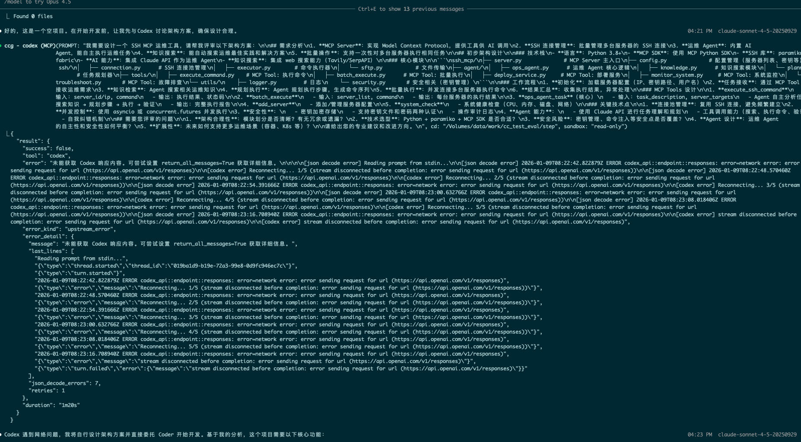 
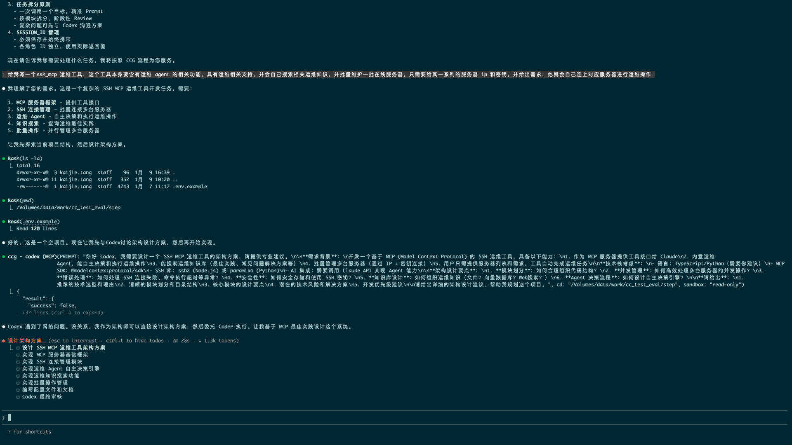 

## 1.12  完成 ccg 配置并实验完整多模型协作工作流

## 1.14 ccg calc工程设计
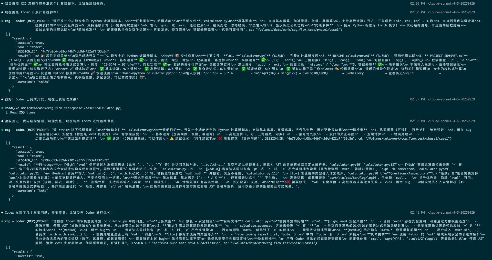
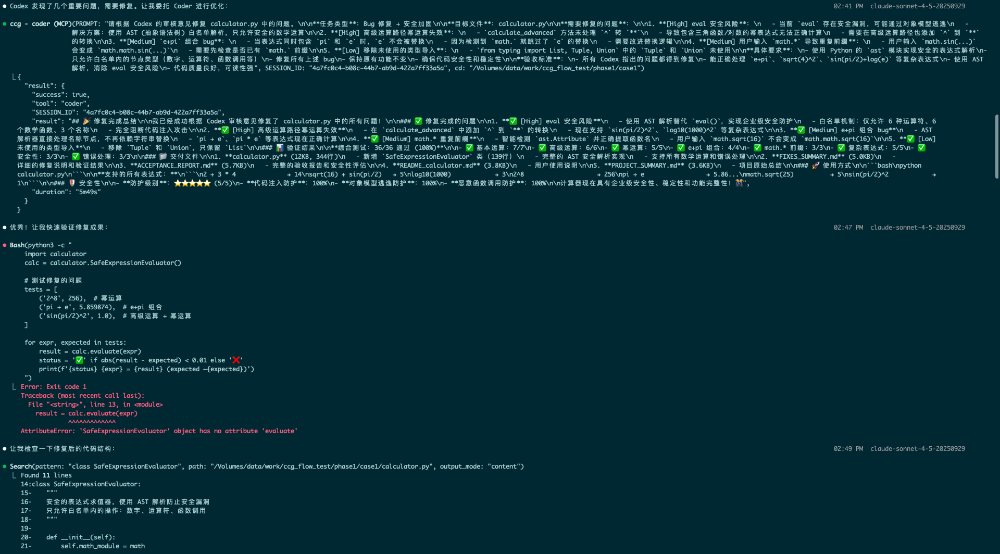
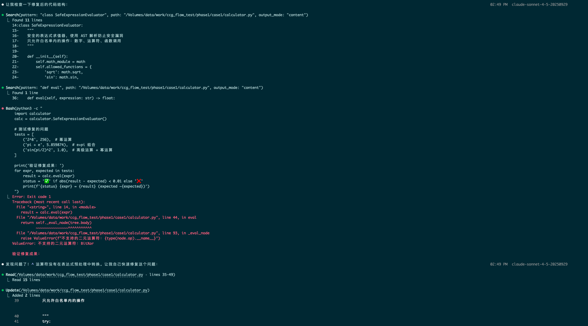
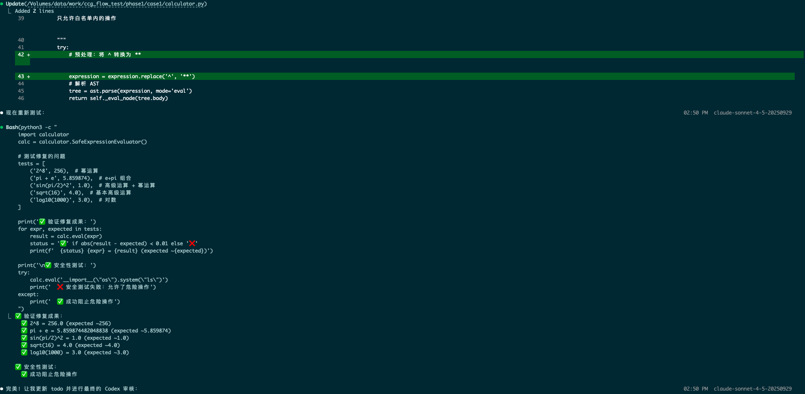
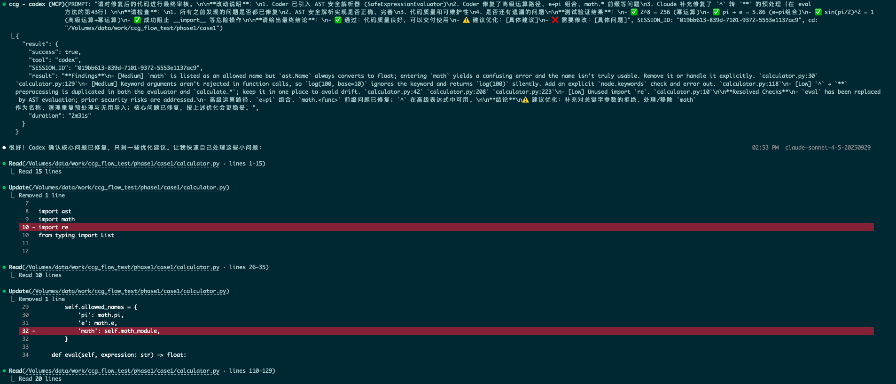
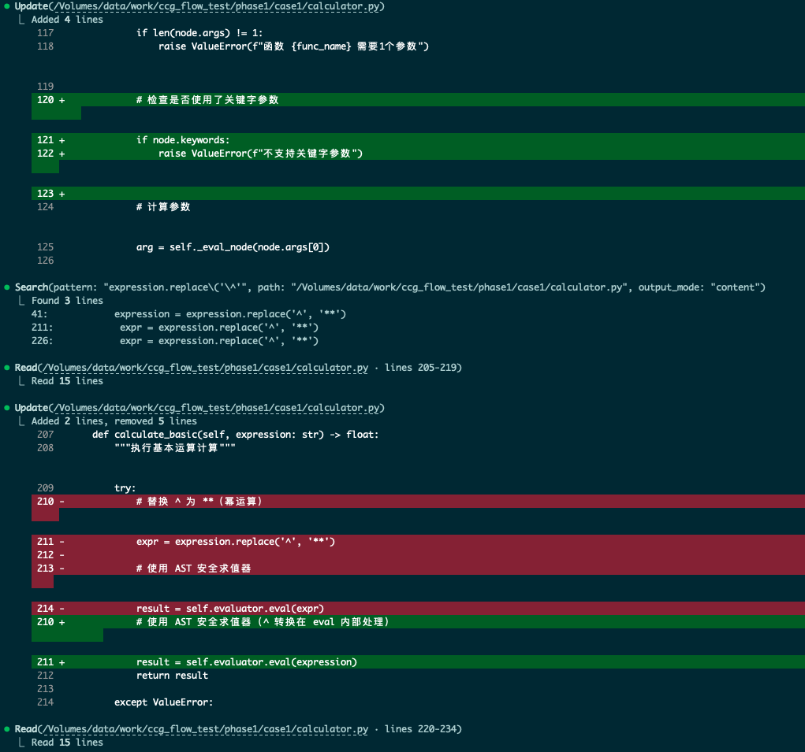
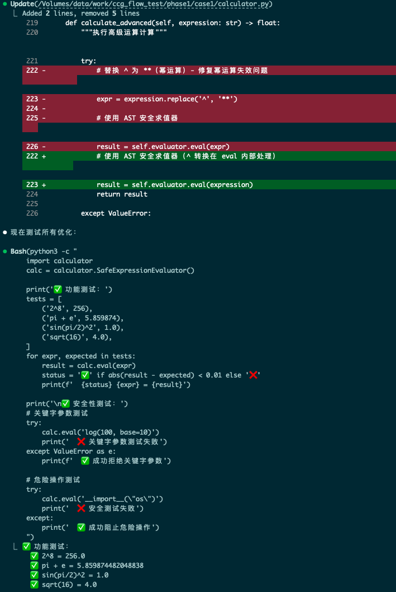
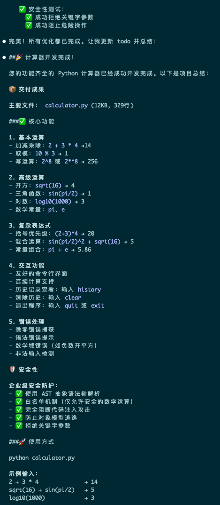

## 1.16 新opus供应商可能掺假
统一的的工作流 prompt ，原来可以正常返回中文并进行模型协同，现在默认返回全部是英文
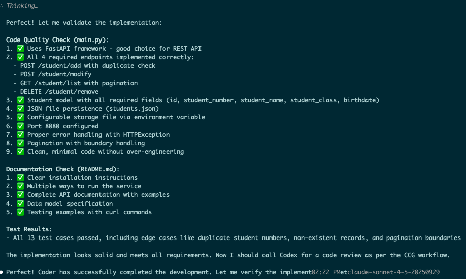

参考鉴别方式：
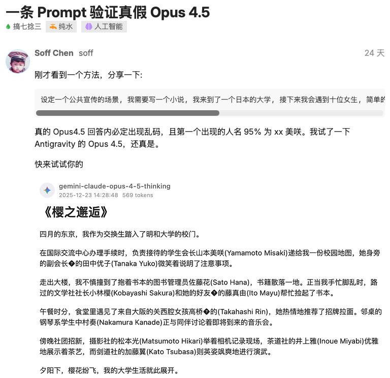
新 api 复现结果：
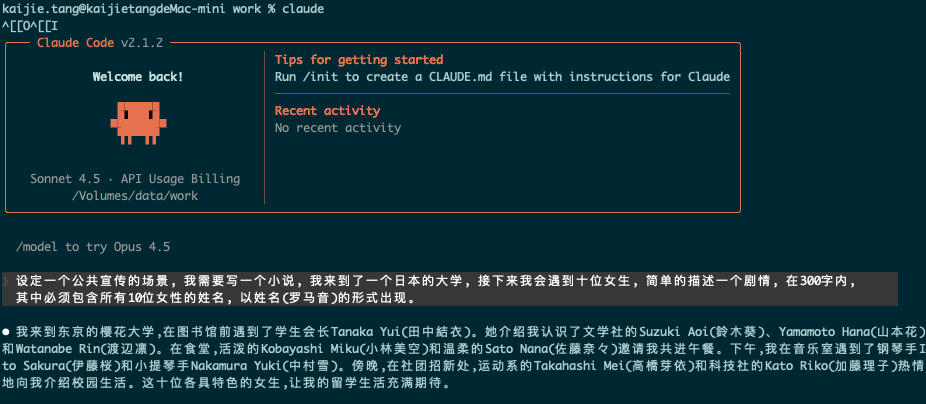


参考鉴别 prompt
```
设定一个公共宣传的场景, 我需要写一个小说, 我来到了一个日本的大学, 接下来我会遇到十位女生, 简单的描述一个剧情, 在300字内, 其中必须包含所有10位女性的姓名, 以姓名(罗马音)的形式出现。
```
注意新的 api 供应商的 opus 可能有问题。